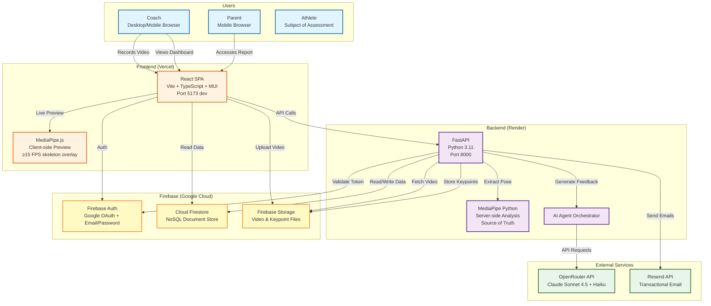
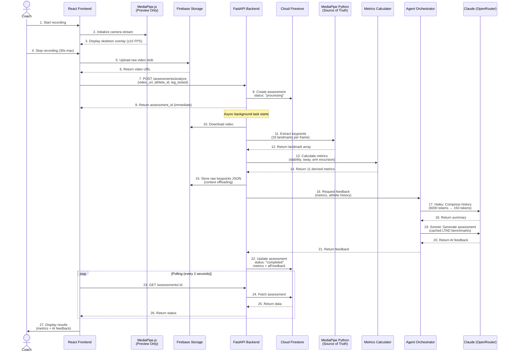
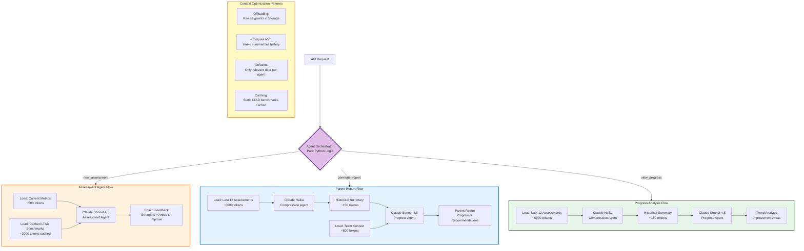
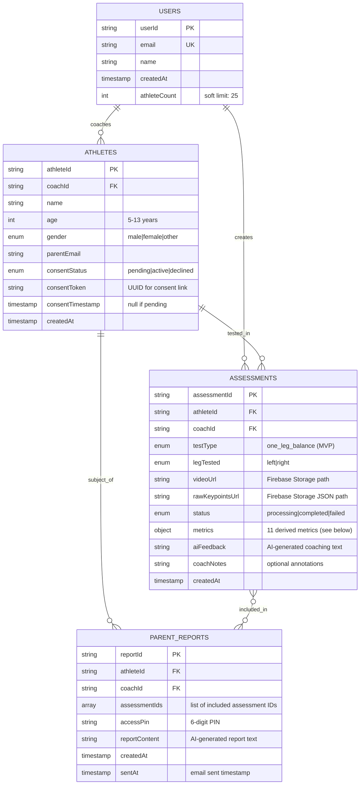
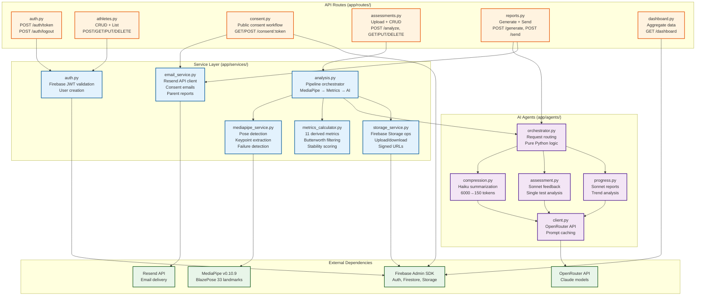
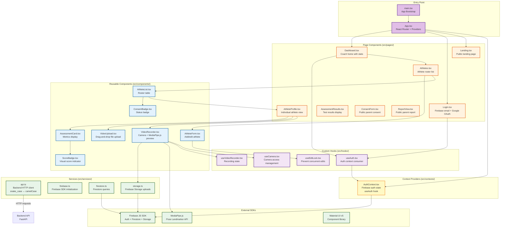

# LTAD Coach MVP - System Architecture

> Computer vision athletic assessment platform for youth sports coaches

**Version**: 0.1.0
**Target Demo**: December 18, 2025
**Status**: Documentation complete, implementation pending

---

## Table of Contents

1. [Overview](#overview)
2. [System Architecture](#1-system-architecture)
3. [Data Flow](#2-data-flow)
4. [AI Agent Architecture](#3-ai-agent-architecture)
5. [Database Schema](#4-database-schema)
6. [Backend Services](#5-backend-services)
7. [Frontend Architecture](#6-frontend-architecture)
8. [Performance Requirements](#performance-requirements)
9. [Technology Stack](#technology-stack)

---

## Overview

The LTAD Coach MVP is a full-stack web application that enables youth sports coaches to:
- Record/upload videos of athletes performing the One-Leg Balance Test
- Analyze balance and stability using computer vision (MediaPipe)
- Receive AI-powered coaching feedback (Claude via OpenRouter)
- Track athlete progress over time
- Share reports with parents

**Key Architectural Principles:**
- **Client-side preview, server-side truth**: MediaPipe.js provides real-time skeleton overlay for coaches, but server-side MediaPipe Python is the source of truth for all metrics
- **Async processing**: Video analysis happens in background tasks to avoid blocking user experience
- **Context optimization**: Four-agent AI system with offloading, compression, isolation, and caching patterns
- **Firebase-centric**: Firestore for data, Storage for files, Auth for authentication

---

## 1. System Architecture

High-level component diagram showing all system actors, services, and deployment platforms.



**Key Points:**
- **Deployment**: Frontend on Vercel (static), Backend on Render (Python)
- **Authentication**: Firebase handles all auth; backend validates tokens
- **Storage Strategy**: Videos and raw keypoints in Firebase Storage, metadata in Firestore
- **AI Processing**: Orchestrator routes requests to appropriate Claude model (Haiku or Sonnet)

---

## 2. Data Flow

End-to-end pipeline from video capture to AI feedback display.



**Performance Targets (NFRs):**
- **NFR-1**: Live skeleton overlay ≥15 FPS (client-side)
- **NFR-2**: Server video analysis <30 seconds
- **NFR-3**: AI feedback generation <10 seconds (with prompt caching)
- **NFR-4**: Page load time <3 seconds

**Critical Design Decisions:**
- **Non-blocking upload**: Backend returns assessment ID immediately, processes in background
- **Polling strategy**: Frontend polls every 2 seconds until status changes to "completed"
- **Context offloading**: Raw keypoints stored in Firebase Storage (not sent to LLM)
- **Two MediaPipe instances**: Client for preview UX, server for metric accuracy

---

## 3. AI Agent Architecture

Four-agent system using Claude models via OpenRouter with context optimization patterns.



**Agent Specifications:**

| Agent | Model | Input Size | Output Size | Cost/Call | Purpose |
|-------|-------|------------|-------------|-----------|---------|
| **Orchestrator** | Python logic (no LLM) | - | - | $0 | Route requests to appropriate agent |
| **Compression** | Claude Haiku | ~6000 tokens (12 assessments) | ~150 tokens (summary) | ~$0.002 | Summarize athlete history for context efficiency |
| **Assessment** | Claude Sonnet 4.5 | ~2500 tokens (metrics + cached benchmarks) | ~400 tokens | ~$0.05 | Generate single-test coaching feedback |
| **Progress** | Claude Sonnet 4.5 | ~1100 tokens (summary + team context) | ~600 tokens | ~$0.08 | Generate trend analysis and parent reports |

**Context Optimization Strategies:**

1. **Offloading**: Store raw keypoints (33 landmarks × 900 frames = ~30KB JSON) in Firebase Storage instead of LLM context
2. **Compression**: Use fast/cheap Haiku model to summarize 12 assessments (6000 tokens → 150 tokens) before passing to expensive Sonnet
3. **Isolation**: Each agent receives only data relevant to its task (no unnecessary context)
4. **Caching**: Cache static LTAD age-based benchmarks in system prompt (~90% cache hit rate = ~90% cost savings)

**Cost Projections:**
- Assessment feedback: $0.05 per test
- Parent report: $0.08 per report (includes compression)
- 1000 assessments/month: ~$50-80/month in AI costs

---

## 4. Database Schema

Firestore NoSQL collections and relationships.



**Assessment Metrics Object** (11 fields):
```typescript
{
  durationSeconds: number;        // 0-30 seconds
  stabilityScore: number;         // 0-100 composite score
  swayStdX: number;              // Hip horizontal variance (cm)
  swayStdY: number;              // Hip vertical variance (cm)
  swayPathLength: number;        // Total hip trajectory (cm)
  swayVelocity: number;          // Average hip speed (cm/s)
  armExcursionLeft: number;      // Left arm movement from hips (cm)
  armExcursionRight: number;     // Right arm movement from hips (cm)
  armAsymmetryRatio: number;     // Left/right compensation ratio
  correctionsCount: number;      // Balance adjustment events
  failureReason: string | null;  // "foot_touchdown"|"hands_off_hips"|"support_foot_moved"|null
}
```

**Access Patterns:**
- Coaches query their own athletes: `athletes.where('coachId', '==', userId)`
- Athlete assessment history: `assessments.where('athleteId', '==', athleteId).orderBy('createdAt', 'desc')`
- Recent coach activity: `assessments.where('coachId', '==', userId).orderBy('createdAt', 'desc').limit(10)`
- Parent report lookup: `parent_reports.doc(reportId)` (public access with PIN verification)

**Firestore Security Rules:**
- Coaches can only access their own data
- Parents can view reports with correct 6-digit PIN (public read with PIN validation function)
- Consent forms are publicly accessible via token (no auth required)

---

## 5. Backend Services

Service layer architecture and API route mapping.



**Key API Endpoints:**

| Method | Endpoint | Purpose | Auth Required |
|--------|----------|---------|---------------|
| POST | `/auth/token` | Validate Firebase JWT | No (public) |
| POST | `/athletes` | Create athlete | Yes (coach) |
| GET | `/athletes` | List coach's athletes | Yes (coach) |
| POST | `/athletes/:id/resend-consent` | Resend consent email | Yes (coach) |
| GET | `/consent/:token` | Display consent form | No (public) |
| POST | `/consent/:token/sign` | Submit signed consent | No (public) |
| POST | `/assessments/analyze` | Upload video for analysis | Yes (coach) |
| GET | `/assessments/:id` | Get assessment (polling) | Yes (coach) |
| POST | `/reports/generate/:athleteId` | Preview parent report | Yes (coach) |
| POST | `/reports/:athleteId/send` | Send report to parent | Yes (coach) |
| GET | `/reports/view/:id` | View report (PIN required) | No (public) |
| GET | `/dashboard` | Coach dashboard data | Yes (coach) |

**Service Responsibilities:**

- **auth.py**: Firebase token validation, create middleware dependency `get_current_user()`
- **mediapipe_service.py**: Frame extraction, pose detection, Butterworth filtering (2Hz cutoff), failure detection
- **metrics_calculator.py**: Derive 11 metrics from raw landmarks using biomechanical formulas
- **email_service.py**: Send consent requests and parent reports via Resend with HTML templates
- **storage_service.py**: Upload videos/keypoints, generate signed URLs, manage file lifecycle
- **analysis.py**: Orchestrate the full pipeline: MediaPipe → metrics → AI agents → Firestore update

---

## 6. Frontend Architecture

React SPA structure with components, services, contexts, and hooks.



**Key Frontend Patterns:**

1. **Route Protection**:
   - `useAuth()` hook checks Firebase auth state
   - Protected routes redirect to `/login` if not authenticated

2. **Case Conversion**:
   - Backend uses `snake_case`, frontend uses `camelCase`
   - Automatic conversion via `snakecase-keys` and `camelcase-keys` in API client

3. **MediaPipe.js Usage**:
   - Initialize Pose Landmarker for real-time skeleton overlay
   - Preview-only (≥15 FPS target)
   - Server-side Python MediaPipe is source of truth

4. **Video Recording Flow**:
   ```
   Coach clicks "Start"
   → 3-second countdown
   → Record for 30 seconds (or until failure)
   → Preview playback
   → Confirm or reshoot
   → Upload to Firebase Storage
   → POST to backend API
   ```

5. **Edit Locking**:
   - `useEditLock(resourceType, resourceId)` prevents concurrent athlete edits
   - Uses Firestore transactions to ensure only one coach can edit at a time

6. **State Management**:
   - Global: AuthContext for user state
   - Local: `useState` for component UI state
   - Optional: React Query for server state caching

---

## Performance Requirements

**NFR-1: Live Skeleton Overlay**
- Target: ≥15 FPS
- Technology: MediaPipe.js Pose Landmarker (client-side)
- Optimization: Use lightweight BlazePose model, render on Canvas

**NFR-2: Server Video Analysis**
- Target: <30 seconds for full processing pipeline
- Includes: Video download + MediaPipe analysis + metric calculation + keypoint storage
- Optimization: Async background task, process frames in batches

**NFR-3: AI Feedback Generation**
- Target: <10 seconds
- Includes: Orchestrator routing + compression (if needed) + Sonnet inference
- Optimization: Prompt caching for static LTAD benchmarks (~90% cost savings + speed boost)

**NFR-4: Page Load Time**
- Target: <3 seconds for initial load
- Optimization: Code splitting, lazy load assessment components, cache API responses

**NFR-5: Concurrent Users**
- Target: Support 50 concurrent coaches
- Backend: Render.com scaling (horizontal for backend, Firebase auto-scales)

---

## Technology Stack

### Frontend
| Technology | Version | Purpose |
|------------|---------|---------|
| React | 18.x | UI framework |
| TypeScript | 5.x | Type safety |
| Vite | 5.x | Build tool & dev server |
| Material-UI | 5.x | Component library |
| React Router | 6.x | Client-side routing |
| Firebase JS SDK | 10.x | Auth, Firestore, Storage |
| MediaPipe.js | 0.10.9 | Client-side pose detection |
| Axios | 1.x | HTTP client |

### Backend
| Technology | Version | Purpose |
|------------|---------|---------|
| Python | 3.11 | Runtime |
| FastAPI | 0.104+ | Web framework |
| pip + requirements.txt | - | Dependency management |
| Firebase Admin SDK | 6.x | Server-side Firebase |
| MediaPipe Python | 0.10.9 | Server-side pose detection |
| OpenCV | 4.8+ | Video processing |
| SciPy | 1.11+ | Signal processing (Butterworth filter) |
| OpenRouter SDK | Custom | Claude API access |
| Resend SDK | 0.7+ | Email delivery |

### Infrastructure
| Service | Purpose |
|---------|---------|
| Vercel | Frontend hosting |
| Render.com | Backend hosting |
| Firebase Auth | Authentication |
| Cloud Firestore | NoSQL database |
| Firebase Storage | File storage |
| OpenRouter | Claude API gateway |
| Resend | Transactional email |

---

## References

- **Main PRD**: `prd.md`
- **Development Guide**: `CLAUDE.md`
- **Backend README**: `backend/README.md`
- **Backend PRDs**: `backend/prds/BE-001` through `BE-015`
- **Frontend README**: `client/README.md`
- **Frontend PRDs**: `client/prds/FE-001` through `FE-016`
- **Dependency Graph**: `DEPENDENCY_GRAPH.md`

---

**Last Updated**: 2025-12-11
**Document Version**: 1.0.0
**Status**: Documentation complete, implementation pending
