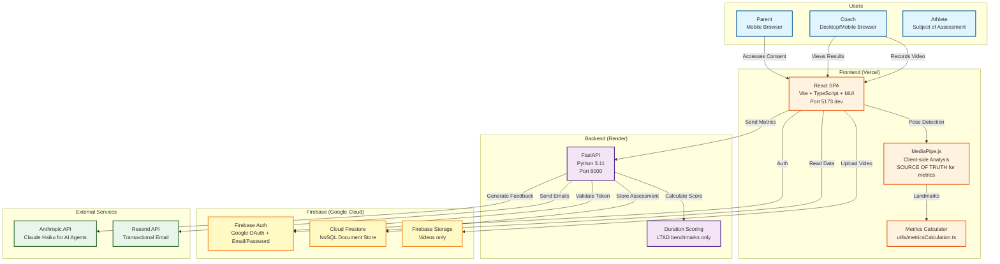
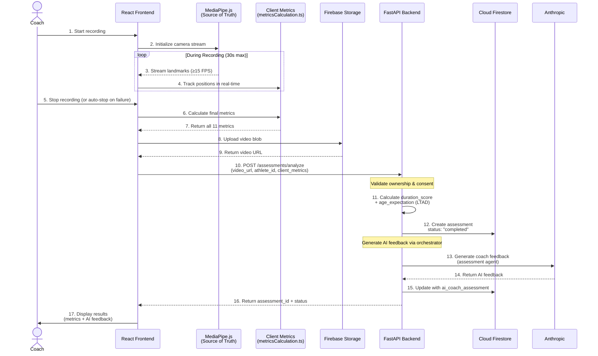
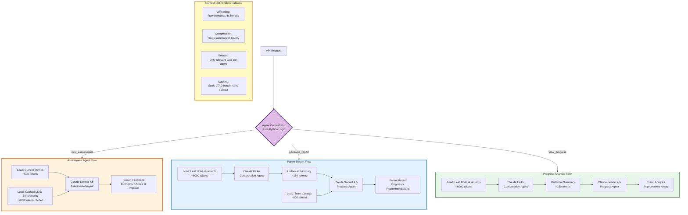
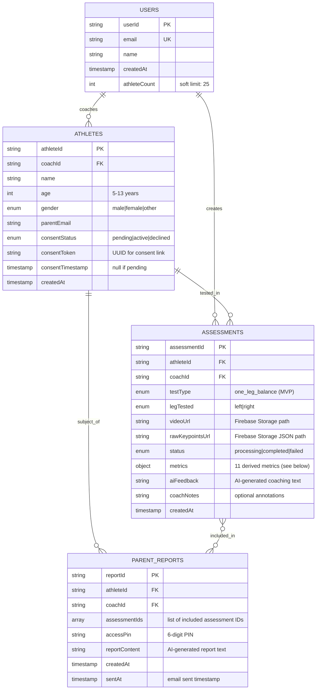
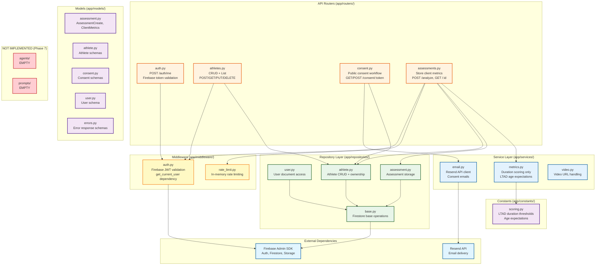
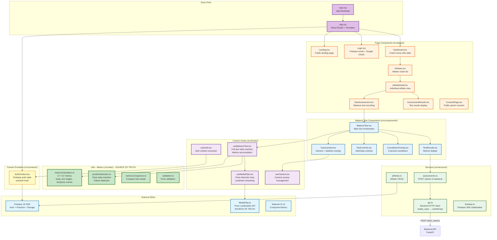

# LTAD Coach MVP - System Architecture

> Computer vision athletic assessment platform for youth sports coaches

**Version**: 0.3.0
**Target Demo**: December 18, 2025
**Status**: Phases 0-7 implemented, Phase 8+ pending

> **Architecture Evolution**: The implementation has diverged from the original PRD. Key change: MediaPipe analysis now runs client-side (not server-side). The client is the source of truth for all CV metrics. See details below.

---

## Table of Contents

1. [Overview](#overview)
2. [System Architecture](#1-system-architecture)
3. [Data Flow](#2-data-flow)
4. [AI Agent Architecture](#3-ai-agent-architecture)
5. [Database Schema](#4-database-schema)
6. [Backend Services](#5-backend-services)
7. [Frontend Architecture](#6-frontend-architecture)
8. [Performance Requirements](#performance-requirements)
9. [Technology Stack](#technology-stack)

---

## Overview

The LTAD Coach MVP is a full-stack web application that enables youth sports coaches to:
- Record/upload videos of athletes performing the One-Leg Balance Test
- Analyze balance and stability using computer vision (MediaPipe)
- Receive AI-powered coaching feedback (Claude via OpenRouter)
- Track athlete progress over time
- Share reports with parents

**Key Architectural Principles (Current Implementation):**
- **Client-side metrics**: MediaPipe.js calculates all CV metrics client-side; backend validates and stores
- **Synchronous processing**: Assessments complete immediately (no background tasks needed)
- **Backend as proxy**: Backend validates auth/consent, calculates LTAD scores, and generates AI feedback
- **Firebase-centric**: Firestore for data, Storage for videos, Auth for authentication
- **AI agents operational**: Phase 7 AI feedback fully implemented via orchestrator

---

## 1. System Architecture

High-level component diagram showing all system actors, services, and deployment platforms.



**Key Points (Current Implementation):**
- **Deployment**: Frontend on Vercel (static), Backend on Render (Python)
- **Authentication**: Firebase handles all auth; backend validates tokens
- **Metrics Calculation**: Client-side MediaPipe.js is source of truth (not server-side)
- **Storage Strategy**: Videos in Firebase Storage, metrics in Firestore
- **AI Processing**: Fully operational via orchestrator (Phase 7 complete)

---

## 2. Data Flow

End-to-end pipeline from video capture to results display.

> **Note**: This diagram reflects the CURRENT implementation, which differs from the original PRD. Client-side MediaPipe is the source of truth.



**Performance Targets (NFRs):**
- **NFR-1**: Live skeleton overlay ≥15 FPS (client-side) ✅ Achieved
- **NFR-2**: Assessment storage <2 seconds (no server-side video processing)
- **NFR-3**: AI feedback generation <10 seconds ✅ Achieved (3-6 seconds typical)
- **NFR-4**: Page load time <3 seconds ✅ Achieved

**Current Design Decisions:**
- **Client as source of truth**: All CV metrics calculated in browser via MediaPipe.js
- **Synchronous flow**: No background processing, assessments complete immediately
- **Backend validation only**: Backend validates auth, consent, calculates LTAD scores
- **No polling needed**: Assessment returns as "completed" immediately

---

## 3. AI Agent Architecture

> **✅ STATUS: IMPLEMENTED (Phase 7 Complete)**
>
> The AI agent system is fully operational. All four agents are implemented in `backend/app/agents/` with static LTAD context in `backend/app/prompts/static_context.py`. Currently using Claude Haiku for all agents via Anthropic API (direct, not OpenRouter).

Four-agent system using Claude models via Anthropic API with context optimization patterns.



**Implemented Agent Specifications:**

| Agent | Model | Input Size | Output Size | Cost/Call | Purpose |
|-------|-------|------------|-------------|-----------|---------|
| **Orchestrator** | Python logic (no LLM) | - | - | $0 | Route requests and execute appropriate workflow |
| **Compression** | Claude Haiku | ~6000 tokens (12 assessments) | ~150 words (summary) | ~$0.002 | Summarize athlete history for context efficiency |
| **Assessment** | Claude Haiku | ~2500 tokens (metrics + LTAD context) | ~200 words | ~$0.005 | Generate single-test coaching feedback |
| **Progress** | Claude Haiku | ~1100 tokens (summary + team context) | ~350 words | ~$0.008 | Generate trend analysis and parent reports |

**Implemented Context Optimization Strategies:**

1. **Offloading**: Raw keypoints (33 landmarks × 900 frames = ~30KB JSON) stored in Firebase Storage, not sent to LLM
2. **Compression**: Haiku model summarizes 12 assessments (~6000 tokens → ~150 words) before passing to Progress agent
3. **Isolation**: Each agent receives only relevant data via orchestrator routing
4. **Unified Entry Point**: All AI operations go through `orchestrator.generate_feedback()` for consistency
5. **Fallback Mechanisms**: Template-based responses provided when API calls fail

**Actual Costs:**
- Assessment feedback: ~$0.005 per test (Haiku)
- Progress report: ~$0.010 per report (includes compression)
- 1000 assessments/month: ~$5-10/month in AI costs (using Haiku)
- System designed to support Sonnet upgrade when access is granted

---

## 4. Database Schema

Firestore NoSQL collections and relationships.



**Assessment Metrics Object** (all metrics in real-world units):
```typescript
{
  // Time
  holdTime: number;              // 0-30 seconds

  // Sway metrics (cm)
  swayStdX: number;              // Hip horizontal variance (cm)
  swayStdY: number;              // Hip vertical variance (cm)
  swayPathLength: number;        // Total hip trajectory (cm)
  swayVelocity: number;          // Average hip speed (cm/s)
  correctionsCount: number;      // Balance adjustment events

  // Arm metrics (degrees)
  armAngleLeft: number;          // Left arm angle from horizontal (degrees, 0° = T-position)
  armAngleRight: number;         // Right arm angle from horizontal (degrees)
  armAsymmetryRatio: number;     // Left/right angle ratio

  // Scores
  stabilityScore: number;        // 0-100 composite score
  durationScore: number;         // 1-5 LTAD score
  durationScoreLabel: string;    // "Beginning"|"Developing"|"Competent"|"Proficient"|"Advanced"
  ageExpectation?: string;       // "above"|"meets"|"below"

  // Temporal analysis (fatigue pattern)
  temporal?: {
    firstThird: SegmentMetrics;  // Metrics for first 33% of test
    middleThird: SegmentMetrics; // Metrics for 33-66% of test
    lastThird: SegmentMetrics;   // Metrics for final 33% of test
  }
}
```

**Access Patterns:**
- Coaches query their own athletes: `athletes.where('coachId', '==', userId)`
- Athlete assessment history: `assessments.where('athleteId', '==', athleteId).orderBy('createdAt', 'desc')`
- Recent coach activity: `assessments.where('coachId', '==', userId).orderBy('createdAt', 'desc').limit(10)`
- Parent report lookup: `parent_reports.doc(reportId)` (public access with PIN verification)

**Firestore Security Rules:**
- Coaches can only access their own data
- Parents can view reports with correct 6-digit PIN (public read with PIN validation function)
- Consent forms are publicly accessible via token (no auth required)

---

## 5. Backend Services

> **Note**: This section reflects the CURRENT implementation, which differs from the original PRD. The backend serves as a validated write proxy - receiving pre-calculated metrics from the client.

Service layer architecture and API route mapping.



**Implemented API Endpoints:**

| Method | Endpoint | Purpose | Auth Required |
|--------|----------|---------|---------------|
| GET | `/auth/me` | Validate Firebase JWT, return user | Yes |
| POST | `/athletes` | Create athlete | Yes (coach) |
| GET | `/athletes` | List coach's athletes | Yes (coach) |
| GET | `/athletes/:id` | Get single athlete | Yes (coach) |
| PUT | `/athletes/:id` | Update athlete | Yes (coach) |
| DELETE | `/athletes/:id` | Delete athlete | Yes (coach) |
| POST | `/athletes/:id/resend-consent` | Resend consent email | Yes (coach) |
| GET | `/consent/:token` | Display consent form | No (public) |
| POST | `/consent/:token/respond` | Submit consent response | No (public) |
| POST | `/assessments/analyze` | Store client-calculated metrics | Yes (coach) |
| GET | `/assessments/:id` | Get assessment | Yes (coach) |

**Not Yet Implemented (Phase 7+):**

| Method | Endpoint | Purpose | Status |
|--------|----------|---------|--------|
| POST | `/reports/generate/:athleteId` | AI parent report | Phase 7 |
| POST | `/reports/:athleteId/send` | Send report to parent | Phase 7 |
| GET | `/reports/view/:id` | View report (PIN) | Phase 7 |
| GET | `/dashboard` | Coach dashboard data | Phase 8 |

**Current Service Responsibilities:**

- **middleware/auth.py**: Firebase token validation, `get_current_user()` dependency
- **middleware/rate_limit.py**: In-memory rate limiting (10 assessments/hour)
- **services/metrics.py**: Duration scoring (1-5 scale), age expectations lookup
- **services/email.py**: Send consent requests via Resend
- **repositories/base.py**: Common Firestore CRUD operations
- **repositories/assessment.py**: `create_completed()` for storing client metrics
- **constants/scoring.py**: LTAD duration thresholds and age-based expectations

---

## 6. Frontend Architecture

> **Note**: The frontend is the SOURCE OF TRUTH for all CV metrics. MediaPipe.js runs client-side and calculates all 11 metrics before sending to the backend.

React SPA structure with components, services, contexts, and hooks.



**Key Frontend Patterns:**

1. **Client-Side Metrics Calculation (SOURCE OF TRUTH)**:
   ```typescript
   // utils/metricsCalculation.ts
   export function calculateMetrics(landmarks: NormalizedLandmark[][]): ClientMetrics {
     return {
       holdTime,           // Seconds in valid position
       stabilityScore,     // 0-100 composite score
       swayStdX,          // Hip horizontal variance
       swayStdY,          // Hip vertical variance
       swayPathLength,    // Total hip trajectory
       swayVelocity,      // Average hip speed
       armDeviationLeft,  // Left arm movement
       armDeviationRight, // Right arm movement
       armAsymmetryRatio, // L/R compensation ratio
       correctionsCount,  // Balance adjustments
       failureReason,     // null or failure type
     };
   }
   ```

2. **Balance Test State Machine (useBalanceTest)**:
   ```
   idle → countdown → recording → calculating → completed
                  ↓                    ↓
               failed ←──────────── failed
   ```

3. **Route Protection**:
   - `useAuth()` hook checks Firebase auth state
   - Protected routes redirect to `/login` if not authenticated

4. **Case Conversion**:
   - Backend uses `snake_case`, frontend uses `camelCase`
   - Automatic conversion via `snakecase-keys` and `camelcase-keys` in API client

5. **MediaPipe.js Usage**:
   - Initialize Pose Landmarker in `useMediaPipe` hook
   - Stream landmarks at ≥15 FPS to `useBalanceTest`
   - `useBalanceTest` accumulates positions for metric calculation
   - **Client is source of truth** - backend only stores and adds duration score

6. **Video Recording Flow**:
   ```
   Coach clicks "Start"
   → 3-second countdown (CountdownOverlay)
   → Record for 30 seconds (or until failure detected)
   → Calculate all 11 metrics (metricsCalculation.ts)
   → Upload video to Firebase Storage
   → POST metrics to backend (/assessments/analyze)
   → Backend adds duration_score + age_expectation
   → Display results (TestResults)
   ```

7. **State Management**:
   - Global: AuthContext for user state
   - Local: `useState` for component UI state
   - Hook-based: `useBalanceTest` manages full test lifecycle

---

## Performance Requirements

**NFR-1: Live Skeleton Overlay** ✅ ACHIEVED
- Target: ≥15 FPS
- Technology: MediaPipe.js Pose Landmarker (client-side)
- Optimization: Use lightweight BlazePose model, render on Canvas
- Status: Implemented in `useMediaPipe` hook

**NFR-2: Assessment Storage** ✅ ACHIEVED (changed from original)
- Target: <2 seconds
- Original: <30 seconds for server-side video analysis
- Current: Client calculates metrics, backend only stores - no server-side processing
- Note: Server-side MediaPipe analysis NOT IMPLEMENTED

**NFR-3: AI Feedback Generation** ❌ NOT IMPLEMENTED
- Target: <10 seconds
- Status: Phase 7 - AI agents not yet implemented
- Planned: Orchestrator routing + compression + Sonnet inference

**NFR-4: Page Load Time** ✅ ACHIEVED
- Target: <3 seconds for initial load
- Optimization: Code splitting, lazy load assessment components, cache API responses

**NFR-5: Concurrent Users**
- Target: Support 50 concurrent coaches
- Backend: Render.com scaling (horizontal for backend, Firebase auto-scales)
- Rate limiting: 10 assessments/hour per coach (in-memory)

---

## Technology Stack

### Frontend (Implemented)
| Technology | Version | Purpose | Status |
|------------|---------|---------|--------|
| React | 18.x | UI framework | ✅ |
| TypeScript | 5.x | Type safety | ✅ |
| Vite | 5.x | Build tool & dev server | ✅ |
| Material-UI | 5.x | Component library | ✅ |
| React Router | 6.x | Client-side routing | ✅ |
| Firebase JS SDK | 10.x | Auth, Firestore, Storage | ✅ |
| MediaPipe.js | 0.10.x | Client-side pose detection (SOURCE OF TRUTH) | ✅ |
| Axios | 1.x | HTTP client | ✅ |

### Backend (Implemented)
| Technology | Version | Purpose | Status |
|------------|---------|---------|--------|
| Python | 3.11 | Runtime | ✅ |
| FastAPI | 0.104+ | Web framework | ✅ |
| pip + requirements.txt | - | Dependency management | ✅ |
| Firebase Admin SDK | 6.x | Server-side Firebase | ✅ |
| Resend SDK | 0.7+ | Email delivery | ✅ |
| Pydantic | 2.x | Data validation | ✅ |

### Backend (NOT Implemented - Phase 7)
| Technology | Version | Purpose | Status |
|------------|---------|---------|--------|
| MediaPipe Python | 0.10.9 | Server-side pose detection | ❌ Not used |
| OpenCV | 4.8+ | Video processing | ❌ Not used |
| SciPy | 1.11+ | Signal processing | ❌ Not used |
| OpenRouter SDK | Custom | Claude API access | ❌ Phase 7 |

### Infrastructure
| Service | Purpose | Status |
|---------|---------|--------|
| Vercel | Frontend hosting | ✅ |
| Render.com | Backend hosting | ✅ |
| Firebase Auth | Authentication | ✅ |
| Cloud Firestore | NoSQL database | ✅ |
| Firebase Storage | Video storage | ✅ |
| Resend | Transactional email | ✅ |
| OpenRouter | Claude API gateway | ❌ Phase 7 |

---

## References

- **Main PRD**: `prd.md`
- **Development Guide**: `CLAUDE.md`
- **Backend README**: `backend/README.md`
- **Backend PRDs**: `backend/prds/BE-001` through `BE-015`
- **Frontend README**: `client/README.md`
- **Frontend PRDs**: `client/prds/FE-001` through `FE-016`
- **Dependency Graph**: `DEPENDENCY_GRAPH.md`

---

**Last Updated**: 2025-12-13
**Document Version**: 0.3.0
**Status**: Updated to reflect actual implementation (Phases 0-7 complete, Phase 8+ pending)
